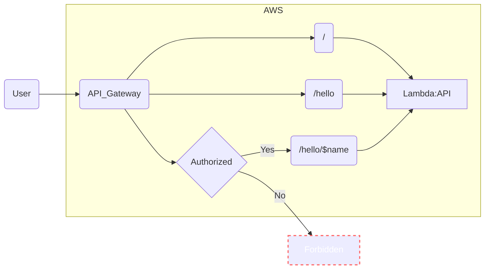
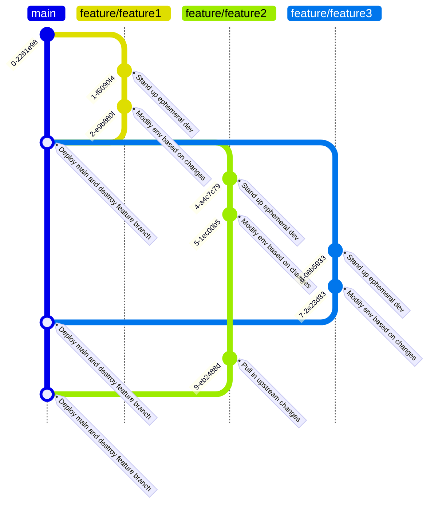

<!--
title: 'AWS Serverless example in Python'
description: 'This template demonstrates how to make a simple HTTP API with Python running on AWS Lambda and API Gateway using the Serverless Framework.'
layout: Doc
framework: v3
platform: AWS
language: python
authorLink: 'https://github.com/serverless'
authorName: 'Serverless, inc.'
authorAvatar: 'https://avatars1.githubusercontent.com/u/13742415?s=200&v=4'
-->

# Serverless Framework Python on AWS

This repository serves as a demonstrative platform for showcasing the capabilities of Python lambdas and serverless architectures, providing developers with a reference for understanding these technologies.

It has examples of these services:

- API Gateway
- DynamoDB
- S3
- SNS
- SQS

For each of these (except s3 for policy reasons) we stand up all of the infrastructure that we need for a given environment.

## Usage


## Services

### API Gateway



### Deployment

This repo is setup to deploy `main` and `feature*` branches to the devs-sbx aws account via github actions (check the .github/workflows directory)

Should you want to deploy from local (not recommended) you would need to setup your aws credentials in your terminal before running anything.

```bash
serverless deploy
```

After deploying, you should see output similar to:

```bash
Deploying aws-python-http-api-project to stage dev (us-east-1)

✔ Service deployed to stack aws-python-http-api-project-dev (140s)

endpoint: GET - https://xxxxxxxxxx.execute-api.us-east-1.amazonaws.com/
functions:
  hello: aws-python-http-api-project-dev-hello (2.3 kB)
```

>⚠️
> In current form, after deployment, your API is public and can be invoked by anyone. For production deployments, you might want to configure an authorizer. For details on how to do that, refer to [http event docs](https://www.serverless.com/framework/docs/providers/aws/events/apigateway/).

### Invocation

After successful deployment, you can call the created application via HTTP:

```bash
curl https://xxxxxxx.execute-api.us-east-1.amazonaws.com/
```

Which should result in response similar to the following (removed `input` content for brevity):

```json
{
  "message": "Go Serverless v3.0! Your function executed successfully!",
  "input": {
    ...
  }
}
```

### Local development

You can invoke your function locally by using the following command:

```bash
serverless invoke local --function hello
```

There are also some example test events in the test directory. We created one for each of the processor lambdas. You can pass them into invoke local like this:

```bash
serverless invoke local --function sqsProcessor --path .\test\sqs.json
```

You can read more about invoke local here:
<https://www.serverless.com/framework/docs/providers/aws/cli-reference/invoke-local>


## Development

## git feature branch workflow

